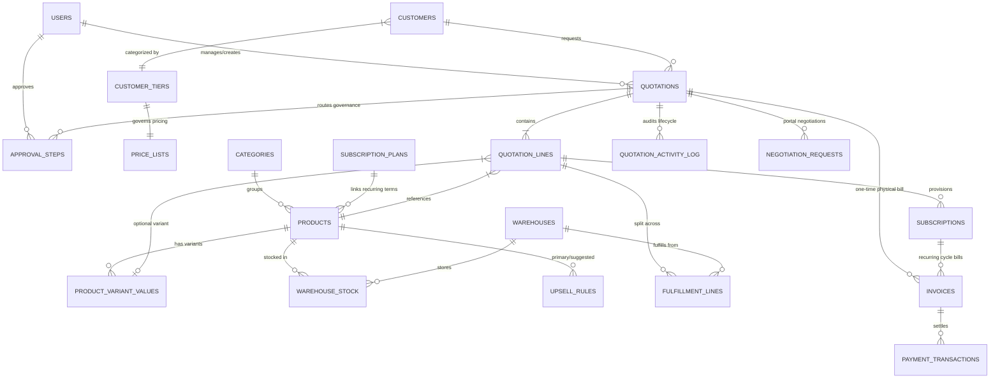

# DealFlow360 — Phase 11 Demo Deliverables & System Architecture

This document contains the official deliverables for **Phase 11 (Demo & Deliverables)** as mandated by `dealflow360_prd.md`:
1. **One-Page System Architecture Diagram** (Entities + Domain Service Boundaries)
2. **5-Minute Live Demo Script** (Two complete end-to-end user journeys)
3. **"What We'd Build Next" Note** (Enterprise roadmap & deferred capabilities)
4. **Quick Test Flow (§9) Verification Matrix**

---

## 1. System Architecture Diagram



### Module Boundaries & Service Architecture

```
┌────────────────────────────────────────────────────────────────────────┐
│                          DealFlow360 Platform                          │
├────────────────────────────────────────────────────────────────────────┤
│ 1. CPQ & Pricing Engine (server/src/routes/quotations.js)               │
│    - Tier Price Resolution (Bronze/Silver/Gold multiplier)             │
│    - Real-Time Margin Indicator ((price * (1-disc) - cost) / price)    │
│    - Contextual Upsell Engine (upsell_rules lookup & margin impact)    │
├────────────────────────────────────────────────────────────────────────┤
│ 2. Governance Risk Engine (server/src/services/governance.js)          │
│    - Dual Ceiling Comparison: MIN(category_ceiling, tier_ceiling)      │
│    - Blended Risk Scoring: low (0), medium (1-10), high (>10 breaches) │
│    - Multi-Step Dynamic Routing: Manager -> Finance -> Auto-Approval   │
├────────────────────────────────────────────────────────────────────────┤
│ 3. Greedy Fulfillment Engine (server/src/services/fulfillment.js)      │
│    - Minimum-Shipment Multi-Warehouse Split (ship_cost_weight priority)│
│    - Inventory Reservation: decrements warehouse_stock.quantity_on_hand│
│    - Automatic Backorder Flagging (is_backorder = true)                │
│    - Delivery Tracking: shipped_at stamping for slippage analytics     │
├────────────────────────────────────────────────────────────────────────┤
│ 4. Hybrid Billing & Ledger (server/src/services/billing.js)            │
│    - Physical / Subscription Split (INV-OT vs Recurring Subscription)  │
│    - Real-Time Payment Settlement (unpaid -> partially_paid -> paid)   │
├────────────────────────────────────────────────────────────────────────┤
│ 5. Customer Portal Negotiation (server/src/routes/portal.js)           │
│    - Client Counter-Offers with Customer Comments                      │
│    - Automatic Governance Re-evaluation on Resolution                  │
└────────────────────────────────────────────────────────────────────────┘
```

---

## 2. 5-Minute Live Demo Script

### Demo Accounts & Credentials

| Role | Email | Password | Primary Demo Responsibilities |
| :--- | :--- | :--- | :--- |
| **Sales Rep** | `rep@dealflow.com` | `Rep@123` | Build quotes, accept upsells, submit for approval |
| **Sales Manager** | `manager@dealflow.com` | `Manager@123` | Review approval queue, evaluate risk, resolve negotiations |
| **Finance** | `finance@dealflow.com` | `Finance@123` | High-risk approvals, record payments, monitor subscriptions |
| **Admin** | `admin@dealflow.com` | `Admin@123` | Configure warehouses, categories, customer tiers, products |
| **Customer** | `acme@customer.com` | `Customer@123` | Client Portal: review quotes, negotiate, confirm orders |

---

### Flow 1: Quotation-to-Cash (5 Minutes)
**Story:** Sales Rep creates a high-margin enterprise quote for Acme Corp with hardware and subscriptions, breaches the discount ceiling, routes to Manager/Finance, fulfills across warehouses, and Finance records payment.

1. **Rep Login & Quote Builder:**
   - Log in as `rep@dealflow.com` / `Rep@123`.
   - Go to **Quotations** -> Click **+ New Quotation**.
   - Select Customer **Acme Corp** (Bronze Tier, auto-resolves standard price list).
   - Add Item 1: **ProLaptop X1** (Hardware category, base ceiling 15%, Bronze ceiling 10%).
     - Quantity: `5`, Discount: `18%`.
     - *Notice:* The UI alerts that 18% exceeds the 10% Bronze tier limit. Live margin % updates instantly.
   - Add Item 2: **CloudStorage Pro** (Subscription category, Monthly billing).
     - Quantity: `2`, Discount: `5%`.
   - Click **Submit for Approval**.
   - *Outcome:* Quote status flips to `pending_approval`. Risk level computed as `high` (breach > 5 points).

2. **Manager & Finance Approval Workflow:**
   - Log out and log in as `manager@dealflow.com` / `Manager@123`.
   - Navigate to **Approvals** -> Select the pending quotation.
   - Inspect the Activity Log and Risk Breakdown tile.
   - Click **Approve Step 1** with comment `"Approved volume deal"`.
   - Log in as `finance@dealflow.com` -> Approve Step 2.
   - *Outcome:* All required steps completed -> Quote status moves to `approved`.

3. **Customer Confirmation via Portal:**
   - Log in as `acme@customer.com` / `Customer@123`.
   - Navigate to **Quotations** -> Click the approved quote.
   - Click **Confirm Order**.
   - *Outcome:* Quote status moves to `confirmed`. Background engine synchronously triggers **Greedy Warehouse Split** and **Hybrid Billing Invoices**.

4. **Greedy Multi-Warehouse Fulfillment:**
   - Log in as `admin@dealflow.com`.
   - Navigate to **Fulfillment** -> Open the quotation.
   - *Outcome:* Notice the order has been split between **North Warehouse** (ship_cost_weight 1.0) and **South Warehouse** (ship_cost_weight 1.5) to minimize total shipping cost.
   - Click **Mark Shipped** on the allocated shipment line. `shipped_at` is stamped.

5. **Hybrid Billing & Payment Recording:**
   - Navigate to **Invoices** (or log in as `finance@dealflow.com`).
   - Notice two invoices were generated:
     - `INV-xxxxx-OT`: One-time physical hardware invoice.
     - `INV-xxxxx-SUB`: Recurring subscription invoice with linked active subscription schedule.
   - Open the one-time invoice -> Click **Record Payment** -> Enter full balance -> Click **Submit**.
   - *Outcome:* Invoice status updates to `paid` with real-time green badge.

---

### Flow 2: Customer Portal Counter-Offer & Automatic Reapproval (3 Minutes)
**Story:** A customer requests an aggressive counter-discount via the Portal. Resolving it triggers an automatic governance re-evaluation, sending it back through approvals before confirmation.

1. **Create Clean Quote:**
   - Sales rep creates a quotation for Acme Corp with a standard 5% discount (within all ceilings).
   - Rep clicks **Submit for Approval**.
   - *Outcome:* Since no ceilings are breached, status skips straight to `approved`.

2. **Customer Negotiates in Portal:**
   - Customer logs into Portal at `/portal/quotations`.
   - Opens the approved quotation -> Clicks **Request Discount / Negotiate**.
   - Selects the line item -> Enters counter-discount `25%` and comment `"Need 25% for annual budgetary approval"`.
   - Clicks **Submit Negotiation Request**.
   - *Outcome:* Quote status flips to `under_negotiation`. Negotiation request is logged.

3. **Rep Resolves & Auto-Reapproval Fires:**
   - Sales Rep opens quote in admin area -> Clicks **Negotiation Requests**.
   - Clicks **Accept Counter-Offer**.
   - *Outcome:* System automatically re-evaluates governance! Because 25% breaches the 10% ceiling, the quotation **automatically moves back to `pending_approval`** and creates a Manager approval step.

4. **Manager Approval & Customer Finalizes:**
   - Sales Manager approves the revision. Status becomes `approved`.
   - Customer clicks **Confirm Quotation** in Portal.
   - *Outcome:* Quotation confirmed, stock allocated, billing initialized.

---

## 3. "What We'd Build Next" Roadmap

The following enterprise capabilities were intentionally deferred during schema v2 design to focus on the core quotation-to-cash engine:

1. **Multi-Currency & Exchange Rate Engine:**
   - Schema currently operates on a single base currency (INR / ₹).
   - Next step: Add a `currencies` table, historical FX rate lookup service, and multi-currency price lists with dynamic spot-rate hedging.

2. **Automated Replenishment Purchase Orders (Auto-PO):**
   - The platform now supports on-hand quantities, reorder thresholds, and reorder quantities (`warehouse_stock`).
   - Next step: A cron job or database trigger that automatically generates vendor Purchase Orders (`supplier_orders`) when `quantity_on_hand <= reorder_threshold`.

3. **Inter-Warehouse Transfer Orders:**
   - Enable automated or ops-initiated stock transfer orders between warehouses to consolidate backorders before customer dispatch.

4. **Magic-Link & SSO Authentication:**
   - Add passwordless magic-link authentication for Customer Portal users and SAML / Okta / Google Workspace SSO for internal staff.

5. **Real-Time Webhooks & ERP Integration:**
   - Outbound webhook events (`quotation.confirmed`, `fulfillment.shipped`, `invoice.paid`) to synchronize downstream ERPs (SAP, NetSuite) and CRMs (Salesforce, HubSpot).

---

## 4. Quick Test Flow (§9) Verification Matrix

All 8 steps of the Quick Test Flow run end-to-end and can be verified using automated test runners:

| Step | Requirement (§9) | Tested By | Status |
| :--- | :--- | :--- | :---: |
| **Setup** | Configure category ceiling, warehouse, tier, sub plan | `test_all_phases.js` (P2) | ✅ Verified |
| **Step 1** | Create quotation for customer with tiered price list | `test_all_phases.js` (P3) | ✅ Verified |
| **Step 2** | Line discount breaching category limit routes to manager | `test_all_phases.js` (P5) | ✅ Verified |
| **Step 3** | Activity feed shows Submitted / Approved / Revised audit trail | `test_all_phases.js` (P5) | ✅ Verified |
| **Step 4** | Accept upsell suggestion, live margin and totals update | `test_all_phases.js` (P4) | ✅ Verified |
| **Step 5** | Fulfillment split pulls from optimal warehouse, flags backorders | `test_all_phases.js` (P6) & `test_e2e_demo_flows.js` | ✅ Verified |
| **Step 6** | One-time product and recurring subscription billed separately | `test_all_phases.js` (P7) & `test_e2e_demo_flows.js` | ✅ Verified |
| **Step 7** | Portal negotiation counter-discount triggers automatic reapproval | `test_customer_lifecycle.js` & `test_e2e_demo_flows.js` | ✅ Verified |
| **Step 8** | Record payment updates invoice status to `paid` | `test_all_phases.js` (P8) & `test_e2e_demo_flows.js` | ✅ Verified |

### Automated Commands to Verify
```bash
# 1. Verify Phase Test Suite (33/33 tests)
node test_all_phases.js

# 2. Verify Customer Lifecycle & Bug-Fix Suite (23/23 tests)
node test_customer_lifecycle.js

# 3. Verify Both Live Demo Flows End-to-End (25/25 tests)
node test_e2e_demo_flows.js

# 4. Verify Production Frontend Build
cd client && npm run build
```
